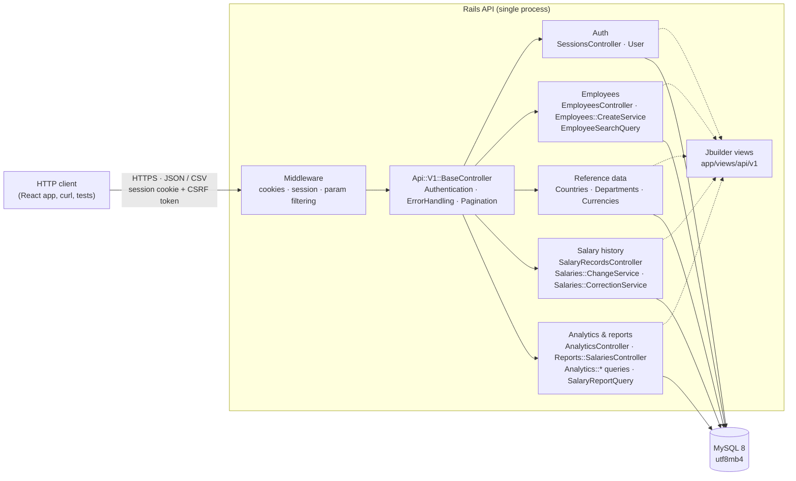
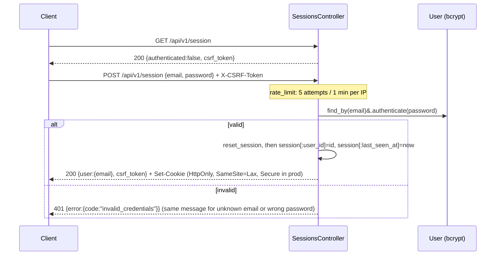
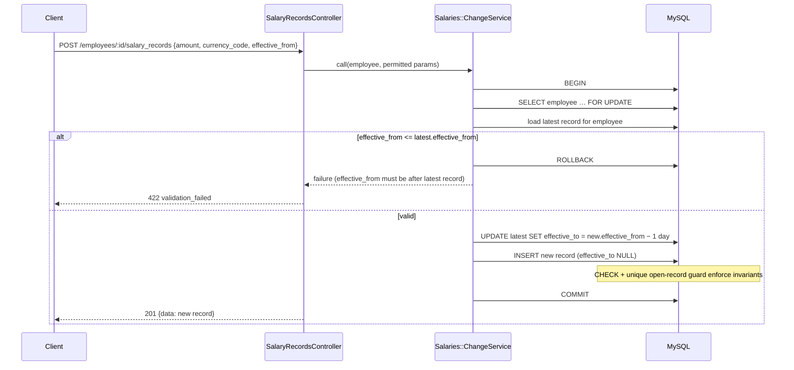

# Salary Management System — Backend Architecture

**Status:** Implemented through Phase 6 (2026-09-29). Changes since v2.2 are listed in §11  
**Version:** 2.3 (2026-09-29)  
**Scope:** Rails REST API and MySQL. The React frontend in `frontend/` is the API's client; its architecture is in [ADR 006](decisions/006-frontend-architecture.md) and `FRONTEND_PLAN.md`.

> **Full-stack app, JSON-only API (G1 kept, H1 approved; BACKEND_PLAN.md Phase 2):** the generated `backend/` is a full-stack Rails 8 app (Propshaft, importmap, Turbo, Stimulus, HTML layouts), kept as generated by the owner. The backend described here is still a JSON API. Its controllers live under `Api::V1`, inherit from `ActionController::Base` directly (not `ApplicationController`), and render only JSON. The frontend gems are unused by the API.

Decision IDs (Dn, Cn) refer to `BACKEND_PLAN.md` Phase 1 findings; approved decisions are summarised in `docs/requirements.md` §10.

## 1. Architectural approach

A **modular monolith**: one Rails API application (Puma) and one MySQL database. Code is organised by business capability inside a single deployable. There are no separate services and no message broker. The Rails 8 defaults Solid Cache and Solid Queue keep caching and background jobs inside MySQL, so no extra infrastructure is needed. Redis and Sidekiq remain excluded (see §9).



## 2. Domain modules and data ownership

| Module | Owns (writes) | Reads | Responsibilities |
|---|---|---|---|
| **Auth** | `users` | — | Login/logout, session lifecycle, CSRF token issue, login rate limit. One seeded HR user; no sign-up (D16). |
| **Employees** | `employees` | reference data, current salary (detail only) | Create/update employees, optional initial salary on create (D14), search/filter/sort/paginate (D23). No hard delete (D13). |
| **Reference data** | `countries`, `departments`, `currencies` (seed only) | — | Read-only lists for filters and validation (D15). |
| **Salary history** | `salary_records` | `employees`, `currencies` | Salary change (new record + close prior period), correction of the current record (D4), history listing, current-salary resolution by as-of date (D7). |
| **Analytics & reports** | nothing (read-only) | `employees`, `salary_records`, reference data | Per-currency total/average/median/distribution and breakdowns (D20–D22); filtered salary report as JSON and CSV (D19, D24). |

Rules:
- Only the Salary history module writes `salary_records`, always through its services, so the history invariants live in one place.
- Analytics and reports never write. They share one "current salary as of date" scope with the Salary history module, so every consumer uses the same definition.
- Currency amounts leave the database only paired with `currency_code`.

## 3. Backend code organisation

```
backend/app/
  controllers/
    api/bad_request.rb                  # Api::BadRequest → 400 with details (raised by QueryParams)
    api/v1/base_controller.rb           # < ActionController::Base; JSON-only; default-deny; CSRF; allow_csv per action (H1, M14)
    api/v1/health_controller.rb         # < ActionController::API; public, no session (E7)
    api/v1/not_found_controller.rb      # catch-all: JSON 404 for any unknown /api/v1 path (L10)
    api/v1/sessions_controller.rb       # GET/POST/DELETE /session; rate-limited sign-in
    api/v1/employees_controller.rb
    api/v1/salary_records_controller.rb
    api/v1/countries_controller.rb, departments_controller.rb, currencies_controller.rb
    api/v1/analytics/summaries_controller.rb, distributions_controller.rb, breakdowns_controller.rb  # singular resources, #show (M7)
    api/v1/reports/salaries_controller.rb  # JSON (paginated) + CSV (allow_csv :index)
    concerns/api/authentication.rb      # require_login, current_user, idle and absolute expiry
    concerns/api/error_handling.rb      # rescue_from → error envelope (incl. RecordNotUnique → 422, N5)
    concerns/api/query_params.rb        # validates page, per_page, sort, enums, IDs, dates, q → 400
    concerns/api/pagination.rb          # wraps pagy; builds meta
    concerns/api/analytics_filters.rb   # shared analytics/report filters → Analytics::Population; Cache-Control: no-store
  helpers/api/formatting_helper.rb      # money(amount, minor_units): BigDecimal, half-up, currency minor units
  models/            user, employee, salary_record, country, department, currency, database_health
  services/          employees/create_service, salaries/change_service, salaries/correction_service
  queries/           employee_search_query, salary_report_query, analytics/{population,median,summary_query,distribution_query,breakdown_query}
  exports/           salary_report_csv (CSV form of the salary report; column allowlist, formula guard, cap)
  views/api/v1/      jbuilder templates per resource, plus shared/_pagination_meta and shared/error
backend/lib/
  reference_data.rb  # countries, departments, currencies (db/seeds.rb)
  demo/              seeder (deterministic 10k synthetic employees), integrity_check
  tasks/hr.rake      # hr:create_user (HR login from ENV)
  tasks/demo.rake    # demo:seed, demo:reset (development only), demo:verify (read-only)
```

Guidelines: controllers parse and permit parameters, call a model, service, or query, and render a jbuilder view (`.claude/rules/backend.md`). Pagination uses `pagy` behind the `Pagination` concern, so the response `meta` shape stays as documented in the API spec §2.3. Services exist only for multi-step writes. Queries exist for any read with joins, aggregates, or dynamic filters. No abstraction is added for single-line operations.

## 4. Main request flows

### 4.1 Login



### 4.2 Salary change (history-preserving)



A correction (`PATCH`) follows the same lock-then-verify pattern. `Salaries::CorrectionService` confirms the record is editable, meaning either in effect today or future-dated (O1), and updates only `amount` and `currency_code`. A historical record returns `422 salary_record_not_editable`.

### 4.3 Analytics

`GET /analytics/summary?country_id=&department_id=&employment_status=&as_of=` → `AnalyticsController` validates filters → `Analytics::SummaryQuery` applies the shared "current salary as of date" scope, excludes terminated employees by default, and groups by `currency_code`. The query computes COUNT, SUM, and AVG in SQL, and the median with window functions (D21). The response returns one row per currency, with `period: "monthly"` and the applied filters echoed back. No cross-currency total is ever produced.

### 4.4 Report and CSV export

`GET /reports/salaries` (JSON, paginated) and `GET /reports/salaries.csv` both build `SalaryReportQuery` from the same permitted filters, so the displayed and exported rows are always the same set (FR-04, FR-06).

The CSV path (`SalaryReportCsv`, implemented in 5.3):
- runs one query that plucks the allowlisted columns in report order with `LIMIT 10,001`, so the rows and their order match the JSON report (Rails batch iteration would force primary-key order);
- enforces the 10,000-row cap (D24): more rows return `422 export_too_large`, with nothing truncated;
- builds the file in memory with `CSV.generate` (about 0.7 MB and 0.3 s for the 9.3k-row demo export) and sends it with `send_data`; nothing is streamed, so errors can still be reported as JSON;
- writes only allowlisted columns;
- prefixes any cell starting with `=`, `+`, `-`, `@`, tab, or CR with a single quote to block formula injection;
- starts with a UTF-8 byte-order mark so Excel shows accented names correctly;
- sets `Cache-Control: no-store`.

Only the report's `index` action may answer `.csv` (`allow_csv :index` in `BaseController`); every other request is forced to JSON, and the report route accepts only `json` and `csv`, so `.xml` returns the JSON `404`. Errors on the CSV path are JSON envelopes.

## 5. Authentication and authorization boundary

- **Mechanism (ADR 004):** `has_secure_password` (bcrypt) on a `users` table holding one HR user, provisioned by `rails hr:create_user` from `HR_USER_EMAIL` and `HR_USER_PASSWORD`. Sign-up and password-reset endpoints do not exist.
- **Controller base (H1):** `Api::V1::BaseController < ActionController::Base`. It inherits directly from `ActionController::Base`, not `ApplicationController`, so it doesn't pick up the HTML-oriented `allow_browser versions: :modern` check. A `before_action` forces `request.format = :json`, so the API never renders HTML. The full-stack app already includes the cookie, session, and CSRF middleware, so no middleware changes are needed.
- **Session:** the standard Rails cookie session store, using the app's default middleware. The cookie is `HttpOnly` and `SameSite=Lax`, and `Secure` outside development. The session is reset on login to prevent fixation.
  - Idle timeout: 30 minutes, via `session[:last_seen_at]`.
  - Absolute lifetime: 8 hours.
- **CSRF:** `protect_from_forgery with: :exception` for state-changing requests. The token is returned by `GET /session` and after login, and the client sends it in `X-CSRF-Token`.
- **Default deny:** `Api::V1::BaseController` runs `require_login` for every action. `SessionsController` opts out explicitly for `GET /session` and `POST /session`. `GET /health` is served by a separate `Api::V1::HealthController < ActionController::API`, which has no session and no authentication (E7).
- **Authorization:** there is one role, so an authenticated user is authorised for every domain endpoint. Unauthenticated requests get `401`. `403` is reserved and unused in v1 (D17). There is no policy layer until a second role is approved.
- **Cross-origin:** the frontend is served same-site; in development the Vite proxy forwards `/api` (ADR 006), so no CORS middleware is installed. Production serving from the API's site is not set up yet (`FRONTEND_PLAN.md` G7). If that changes, `rack-cors` with a single allowed origin is the planned response, recorded as an ADR 004 amendment.

## 6. Error handling contract

Every error uses one envelope, rendered by the `ErrorHandling` concern:

```json
{ "error": { "code": "validation_failed", "message": "Please correct the highlighted fields.", "details": { "amount": ["must be greater than 0"] } } }
```

| Exception / condition | Status | `code` | Notes |
|---|---|---|---|
| Not logged in or session expired | 401 | `unauthenticated` | |
| Bad credentials | 401 | `invalid_credentials` | Does not reveal whether the email exists |
| Login rate limit exceeded | 429 | `rate_limited` | |
| `ActionController::ParameterMissing`, malformed filter or sort | 400 | `bad_request` | Unknown sort fields are rejected, not ignored |
| `ActiveRecord::RecordNotFound` | 404 | `not_found` | Generic message; no ids or record data echoed |
| `ActiveRecord::RecordInvalid`, service validation failure | 422 | `validation_failed` | `details` contains attribute → messages only, never submitted values |
| `ActiveRecord::RecordNotUnique` (lost race to a unique index) | 422 | `validation_failed` | `details` only for `employee_number`/`email`; the duplicate value is never echoed |
| Correction of a historical record | 422 | `salary_record_not_editable` | |
| `ActionController::InvalidAuthenticityToken` | 422 | `invalid_csrf_token` | |
| CSV export would exceed 10,000 rows | 422 | `export_too_large` | No silent truncation (D24) |
| Database unreachable (health check only) | 503 | — | `GET /health` only |
| Any other `StandardError` | 500 | `internal_error` | Generic message; exception class and backtrace go to the log only |

## 7. Logging and data redaction

- `filter_parameters` adds `password`, `amount`, `salary`, `email`, `first_name`, `last_name`, and `csrf_token` on top of the Rails defaults, plus the search parameter `q` as an exact match (search input is often a name; 6.3, BACKEND_PLAN.md N7). The filter applies to both the `Started GET "…?q=[FILTERED]"` request line and the `Parameters:` line. The same list drives `ActiveRecord` `filter_attributes`, so `inspect` output in logs and consoles is redacted too. Tested in `test/integration/api/v1/log_redaction_test.rb` and `test/config/security_config_test.rb`.
- Production log level is `info` (`RAILS_LOG_LEVEL` defaults to `info` in `production.rb`), so SQL statements are not logged. Development may log SQL with synthetic data only. **Verified in 4.4:** at `info`, request parameters are `[FILTERED]` and no amounts or names appear. At `debug`, mysql2 writes values inline in SQL (prepared statements are off), so `filter_attributes` cannot redact them. **Never set `RAILS_LOG_LEVEL=debug` in production.** Enabling `prepared_statements: true` would let Rails redact SQL binds too (open option, not adopted).
- Exceptions are logged with class, message, and request id, never with record attributes. Services never log salary values.
- The CSV export sets `Cache-Control: no-store`. The app never writes export files to disk.

## 8. Time and money conventions

- `config.time_zone = "UTC"`. "Today" means `Date.current` (D9). Effective dates are `DATE` columns.
- Money is `DECIMAL(18,4)`, validated against `currencies.minor_units` (D10). It is serialised as a decimal string and always paired with `currency_code`. Amounts are **monthly gross base** (D3).
- Aggregates are only ever grouped by `currency_code` (ADR 002).

## 9. Deployment assumptions and trade-offs

- **Assessment runtime:** local development with Ruby (RVM), Bundler, and a local MySQL 8.0.16 or later (needed for enforced CHECK constraints). Connection settings come from `backend/.env`, loaded by `dotenv-rails`. Docker support is deferred by the owner. The generated `Dockerfile`, Kamal, and Thruster files are unused until then (G3).
- **Production-like environment (assumed, not specified):** a single Puma process behind a TLS-terminating proxy, with `config.force_ssl = true` and secrets supplied through environment variables. No multi-region deployment, replicas, or cache servers.
- **Deployment prerequisites (6.3, BACKEND_PLAN.md N15; 7.1 F5):**
  - Run `bin/rails db:prepare` in production, so the Solid Cache tables (`db/cache_schema.rb`) exist. The sign-in `rate_limit` counts attempts in `Rails.cache` (Solid Cache), so without them sign-in fails.
  - Set `config.hosts` in `production.rb` (e.g. from an `APP_HOSTS` environment variable) to the served host names. It is unset in the generated app, so host-header checks are off until a deployment exists.
  - Keep `RAILS_LOG_LEVEL` at `info` or above. **Never use `debug` in production:** mysql2 logs SQL with inline values at `debug` (§7). Enabling `prepared_statements: true` would also redact SQL binds; it is optional and not adopted.
  - The session cookie is `Secure` in production (`session_store.rb`, tested in `test/config/security_config_test.rb`), and `force_ssl`/`assume_ssl` are on.
- **Cache, queue, and rate-limit store:** Solid Cache backs `Rails.cache`, and therefore the login `rate_limit`. Solid Queue is the Active Job adapter (no jobs planned). Both use MySQL tables; in development they share the primary database (`db/cache_schema.rb`, `db/queue_schema.rb`). Tests use `:memory_store` for rate-limit tests.
- **Versions and libraries:** Ruby 3.2.0 and Rails 8.0.5; the gem list and its justifications are in ADR 005.

| Concern | Design response | Trade-off accepted |
|---|---|---|
| ~10k employees | Pagination, targeted indexes, SQL aggregates | No caching layer; re-evaluate after measurement in Phase 6 |
| Salary integrity | Row lock + transaction + DB constraints | Mid-history inserts rejected in v1 (D8) |
| Median on MySQL | Window-function query in one query object | More complex SQL than PostgreSQL's `percentile_cont`; covered by known-data tests |
| Export size | Synchronous, built in memory from one capped query (10k rows) | No background export; revisit only if the cap proves insufficient |
| Single user auth | Session cookie + CSRF | Not suited to third-party API clients (not required) |

## 10. Out of scope for this architecture

Payroll, tax, or net-pay computation; currency conversion; external integrations; multiple roles and approval workflows; a separate audit-log store (D5); background jobs; LLM or RAG features. The frontend is outside this document's scope; see ADR 006 and `FRONTEND_PLAN.md`.

## 11. Changelog

- **2.3 (2026-09-29):**
  - §3 code layout matches the implemented tree (Phase 7.1 F8);
  - §6 adds `RecordNotUnique` → `422` (6.1);
  - §7 adds the `q` log filter (6.3);
  - §9 adds deployment prerequisites (`config.hosts`, log level, `Secure` cookie, Solid Cache; 6.3 and 7.1 F5);
  - §4.4 describes the CSV built from one capped query (5.3).
- **2.2 (2026-09-28):** full-stack generated app with a JSON-only API (H1).
