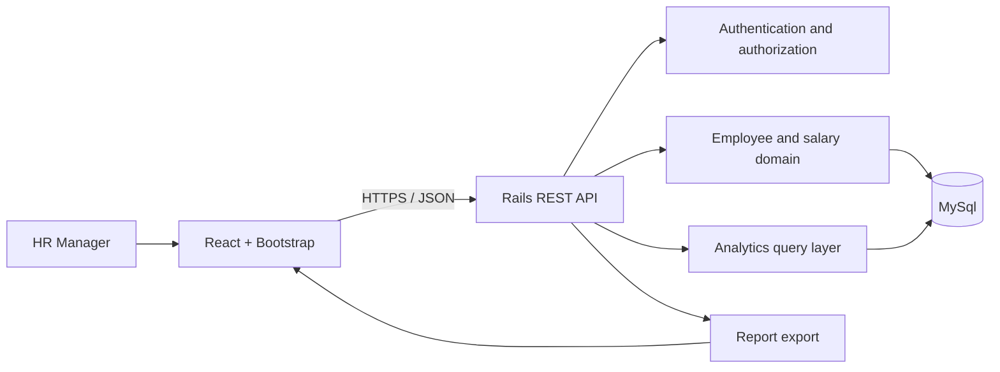

# Salary Management System — Architecture

**Status:** Proposed architecture baseline  
**Version:** 1.0

## 1. Architectural approach

Use a **modular monolith**: one Rails application exposing a REST API, one React frontend, and one MySql database. This keeps deployment and development straightforward while allowing code to be organized by business capability.

## 2. Component responsibilities

### React frontend

- Presents employee, salary, and analytics workflows.
- Calls the Rails API through a centralized API client.
- Handles navigation, forms, filters, pagination, and loading/error states.
- Does not own authoritative business rules or authorization decisions.

### Rails API

- Enforces authentication and server-side authorization.
- Validates and persists employee and salary data.
- Exposes documented REST endpoints.
- Keeps controllers focused on HTTP concerns.
- Uses service objects for multi-step operations and query objects for non-trivial analytics when useful.
- Returns consistent JSON and validation errors.

### MySql

- Stores employees, salary records, and reference data.
- Enforces relational integrity and uniqueness constraints.
- Supports filtered listings and aggregate analytics.
- Stores salary amounts with an explicit currency attribute.

### Optional background processing and cache

Redis and Sidekiq are not required in the initial baseline. Add them only if a demonstrated use case—such as expensive asynchronous exports or measured repeated expensive reads—justifies the operational cost.

## 3. Main request flows

1. The HR Manager signs in through the frontend.
2. React calls protected Rails endpoints with the configured session/token mechanism.
3. Rails authenticates the request and checks authorization.
4. Employee and salary operations validate input and persist changes in MySql.
5. Analytics endpoints run aggregate queries using the selected filters and currency grouping.
6. Export uses the same filter and authorization rules as the corresponding report.

## 4. Suggested backend organization

- `controllers/api/v1/`: versioned HTTP endpoints
- `models/`: persistence and core validations
- `services/`: multi-step business operations, where needed
- `queries/`: analytics and complex read queries
- `serializers/`: stable API response representation
- `policies/` or equivalent: server-side access rules

Avoid creating abstractions for every small method. Use the simplest structure that keeps responsibilities clear.

## 5. Security and privacy

- Require authentication for employee and salary endpoints.
- Enforce authorization on the server; hiding UI controls is not sufficient.
- Store secrets in environment configuration, not source control.
- Validate and permit request fields explicitly.
- Avoid logging salary values or unnecessary employee details.
- Limit exported fields to those needed for the report.
- Use HTTPS in deployed environments.

## 6. Data and currency principles

- Salary amount and currency are a single logical value.
- Analytics must group monetary totals by currency.
- Do not compare or sum unlike currencies as if they were equivalent.
- Salary changes preserve historical records and use an agreed effective-date convention.

## 7. Deployment and environments

For the assessment, support a simple local development setup with separate frontend and backend processes and MySql. Containerization may be used if it improves reproducibility, but Kubernetes, multi-region deployment, and complex cloud infrastructure are not required by the stated scope.

## 8. Quality attributes and trade-offs

| Concern | Design response | Trade-off |
|---|---|---|
| 10,000 employee records | Pagination, indexes, efficient aggregates | Avoid premature distributed scaling |
| Maintainability | Modular Rails code and feature-oriented React structure | Avoid excessive abstraction |
| Data integrity | MySql constraints and transactions | Requires thoughtful migration design |
| Analytics | SQL aggregates and currency-aware grouping | No conversational natural-language layer |
| Future growth | Clear modules and API contract | Keep initial deployment simple |

## 9. Architecture decisions to confirm

- Authentication mechanism appropriate to the deployment context.
- Whether salary effective dates are date-only or timestamp-based.
- Whether exports are synchronous initially or require background processing.
- Any explicit performance, hosting, compliance, or retention requirements supplied later.
