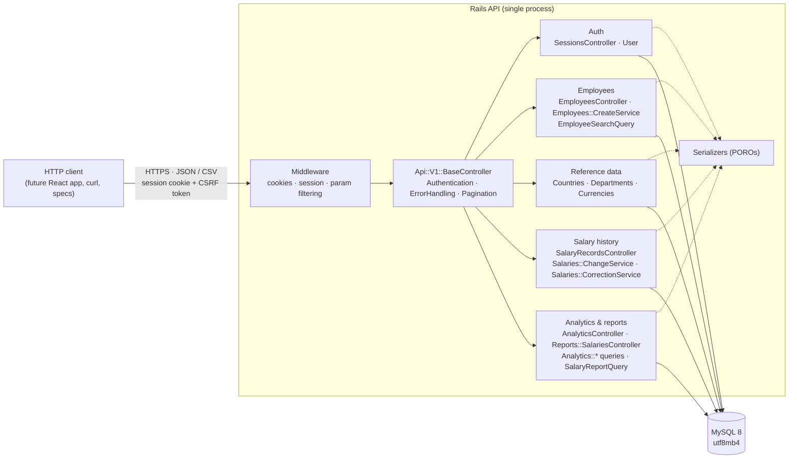
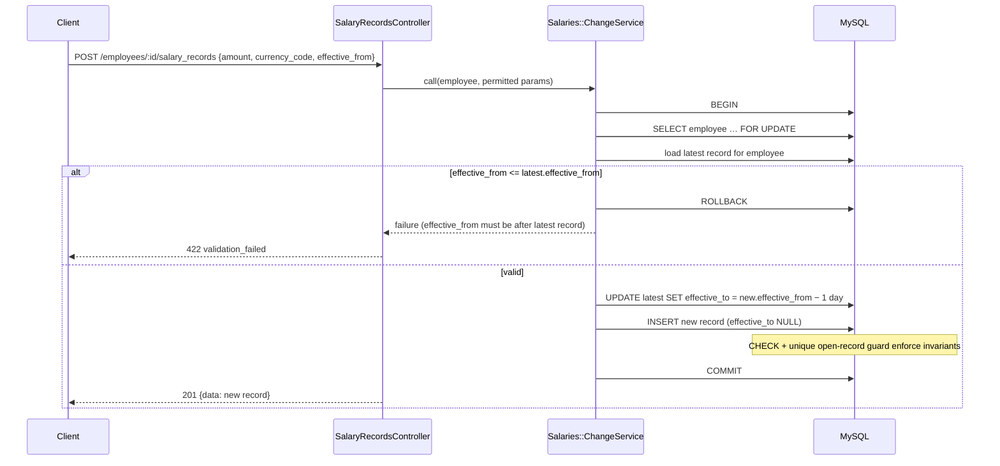

# Salary Management System — Backend Architecture

**Status:** Approved design for backend implementation (BACKEND_PLAN.md task 1.2)  
**Version:** 2.0 (2026-09-28)  
**Scope:** Rails REST API and MySQL. The React frontend is a future client and is planned separately.

Decision IDs (Dn, Cn) refer to `BACKEND_PLAN.md` Phase 1 findings; approved decisions are summarised in `docs/requirements.md` §10.

## 1. Architectural approach

A **modular monolith**: one Rails API application (Puma) and one MySQL database. Code is organised by business capability inside a single deployable. There are no separate services, no message broker, and no cache or job infrastructure. Redis and Sidekiq remain excluded until a measured need exists (see §9).



## 2. Domain modules and data ownership

| Module | Owns (writes) | Reads | Responsibilities |
|---|---|---|---|
| **Auth** | `users` | — | Login/logout, session lifecycle, CSRF token issue, login rate limit. One seeded HR user; no sign-up (D16). |
| **Employees** | `employees` | reference data, current salary (detail only) | Create/update employees, optional initial salary on create (D14), search/filter/sort/paginate (D23). No hard delete (D13). |
| **Reference data** | `countries`, `departments`, `currencies` (seed only) | — | Read-only lists for filters and validation (D15). |
| **Salary history** | `salary_records` | `employees`, `currencies` | Salary change (new record + close prior period), correction of the current record (D4), history listing, current-salary resolution by as-of date (D7). |
| **Analytics & reports** | nothing (read-only) | `employees`, `salary_records`, reference data | Per-currency total/average/median/distribution and breakdowns (D20–D22); filtered salary report as JSON and CSV (D19, D24). |

Rules:
- Only the Salary history module writes `salary_records`, always through its services, so the history invariants live in one place.
- Analytics and reports never write. They share one "current salary as of date" scope with the Salary history module, so every consumer uses the same definition.
- Currency amounts leave the database only paired with `currency_code`.

## 3. Backend code organisation

```
backend/app/
  controllers/
    api/v1/base_controller.rb           # includes the concerns below; default-deny
    api/v1/sessions_controller.rb
    api/v1/employees_controller.rb
    api/v1/salary_records_controller.rb
    api/v1/countries_controller.rb, departments_controller.rb, currencies_controller.rb
    api/v1/analytics_controller.rb      # summary, distribution, breakdown
    api/v1/reports/salaries_controller.rb  # JSON + CSV formats
    concerns/authentication.rb          # require_login, current_user, session expiry
    concerns/error_handling.rb          # rescue_from → error envelope
    concerns/pagination.rb              # page/per_page parsing, meta
  models/            user, employee, salary_record, country, department, currency
  services/          employees/create_service, salaries/change_service, salaries/correction_service
  queries/           employee_search_query, salary_report_query, analytics/{summary,distribution,breakdown}_query
  serializers/       plain Ruby serializers per resource
backend/lib/tasks/   hr_user.rake (provision HR user from ENV), synthetic seed generator
```

Guidelines: controllers parse and permit parameters, call a model, service, or query, and render through a serializer. Services exist only for multi-step writes. Queries exist for any read with joins, aggregates, or dynamic filters. No abstraction is added for single-line operations.

## 4. Main request flows

### 4.1 Login

```mermaid
sequenceDiagram
    participant C as Client
    participant S as SessionsController
    participant U as User (bcrypt)
    C->>S: GET /api/v1/session
    S-->>C: 200 {authenticated:false, csrf_token}
    C->>S: POST /api/v1/session {email, password} + X-CSRF-Token
    Note over S: rate_limit: 5 attempts / 1 min per IP
    S->>U: find_by(email)&.authenticate(password)
    alt valid
        S->>S: reset_session; session[:user_id]=id; session[:last_seen_at]=now
        S-->>C: 200 {user:{email}, csrf_token} + Set-Cookie (HttpOnly, SameSite=Lax, Secure in prod)
    else invalid
        S-->>C: 401 {error:{code:"invalid_credentials"}}  (same message for unknown email or wrong password)
    end
```

### 4.2 Salary change (history-preserving)



A correction (`PATCH`) follows the same lock-then-verify pattern. `Salaries::CorrectionService` confirms the record is editable, meaning either in effect today or future-dated (O1), and updates only `amount` and `currency_code`. A historical record returns `422 salary_record_not_editable`.

### 4.3 Analytics

`GET /analytics/summary?country_id=&department_id=&employment_status=&as_of=` → `AnalyticsController` validates filters → `Analytics::SummaryQuery` applies the shared "current salary as of date" scope, excludes terminated employees by default, and groups by `currency_code`. The query computes COUNT, SUM, and AVG in SQL, and the median with window functions (D21). The response returns one row per currency, with `period: "monthly"` and the applied filters echoed back. No cross-currency total is ever produced.

### 4.4 Report and CSV export

`GET /reports/salaries` (JSON, paginated) and `GET /reports/salaries.csv` both build `SalaryReportQuery` from the same permitted filters, so the displayed and exported rows are always the same set (FR-04, FR-06).

The CSV path:
- streams rows in batches;
- enforces the 10,000-row cap (D24);
- writes only allowlisted columns;
- prefixes any cell starting with `=`, `+`, `-`, `@`, tab, or CR with a single quote to block formula injection;
- sets `Cache-Control: no-store`.

## 5. Authentication and authorization boundary

- **Mechanism (ADR 004):** `has_secure_password` (bcrypt) on a `users` table holding one HR user, provisioned by `rails hr:create_user` from `HR_USER_EMAIL` and `HR_USER_PASSWORD`. Sign-up and password-reset endpoints do not exist.
- **Session:** a Rails cookie session, added back to the API-only middleware stack. The cookie is `HttpOnly` and `SameSite=Lax`, and `Secure` outside development. The session is reset on login to prevent fixation.
  - Idle timeout: 30 minutes, via `session[:last_seen_at]`.
  - Absolute lifetime: 8 hours.
- **CSRF:** `protect_from_forgery with: :exception` for state-changing requests. The token is returned by `GET /session` and after login, and the client sends it in `X-CSRF-Token`.
- **Default deny:** `Api::V1::BaseController` runs `require_login` for every action. Public actions opt out explicitly: `GET /health`, `GET /session`, and `POST /session`.
- **Authorization:** there is one role, so an authenticated user is authorised for every domain endpoint. Unauthenticated requests get `401`. `403` is reserved and unused in v1 (D17). There is no policy layer until a second role is approved.
- **Cross-origin:** the future frontend is served same-site or through a development proxy, so no CORS middleware is installed. If that changes, `rack-cors` with a single allowed origin is the planned response, recorded as an ADR 004 amendment.

## 6. Error handling contract

Every error uses one envelope, rendered by the `ErrorHandling` concern:

```json
{ "error": { "code": "validation_failed", "message": "Please correct the highlighted fields.", "details": { "amount": ["must be greater than 0"] } } }
```

| Exception / condition | Status | `code` | Notes |
|---|---|---|---|
| Not logged in or session expired | 401 | `unauthenticated` | |
| Bad credentials | 401 | `invalid_credentials` | Does not reveal whether the email exists |
| Login rate limit exceeded | 429 | `rate_limited` | |
| `ActionController::ParameterMissing`, malformed filter or sort | 400 | `bad_request` | Unknown sort fields are rejected, not ignored |
| `ActiveRecord::RecordNotFound` | 404 | `not_found` | Generic message; no ids or record data echoed |
| `ActiveRecord::RecordInvalid`, service validation failure | 422 | `validation_failed` | `details` contains attribute → messages only, never submitted values |
| Correction of a historical record | 422 | `salary_record_not_editable` | |
| `ActionController::InvalidAuthenticityToken` | 422 | `invalid_csrf_token` | |
| CSV export would exceed 10,000 rows | 422 | `export_too_large` | No silent truncation (D24) |
| Database unreachable (health check only) | 503 | — | `GET /health` only |
| Any other `StandardError` | 500 | `internal_error` | Generic message; exception class and backtrace go to the log only |

## 7. Logging and data redaction

- `filter_parameters` adds `password`, `amount`, `salary`, `email`, `first_name`, `last_name`, and `csrf_token` on top of the Rails defaults. The same list drives `ActiveRecord` `filter_attributes`, so `inspect` output in logs and consoles is redacted too.
- Production log level is `info`, so SQL statements and their bound values are not logged. Development may log SQL with synthetic data only.
- Exceptions are logged with class, message, and request id, never with record attributes. Services never log salary values.
- The CSV export sets `Cache-Control: no-store`. The app never writes export files to disk.

## 8. Time and money conventions

- `config.time_zone = "UTC"`. "Today" means `Date.current` (D9). Effective dates are `DATE` columns.
- Money is `DECIMAL(18,4)`, validated against `currencies.minor_units` (D10). It is serialised as a decimal string and always paired with `currency_code`. Amounts are **monthly gross base** (D3).
- Aggregates are only ever grouped by `currency_code` (ADR 002).

## 9. Deployment assumptions and trade-offs

- **Assessment runtime:** local development with Ruby, Bundler, and MySQL 8.0.16 or later (needed for enforced CHECK constraints). Docker Compose, if added, runs MySQL only.
- **Production-like environment (assumed, not specified):** a single Puma process behind a TLS-terminating proxy, with `config.force_ssl = true` and secrets supplied through environment variables. No multi-region deployment, replicas, or cache servers.
- **Rate-limit store:** `rate_limit` uses `Rails.cache`. The default cache store is enough for a single process on a single host. If several hosts are introduced, prefer a MySQL-backed store (for example, Solid Cache, which would need an ADR) before considering Redis.
- **Versions and libraries:** Ruby 3.1.2 and Rails 7.2 (ADR 005).

| Concern | Design response | Trade-off accepted |
|---|---|---|
| ~10k employees | Pagination, targeted indexes, SQL aggregates | No caching layer; re-evaluate after measurement in Phase 6 |
| Salary integrity | Row lock + transaction + DB constraints | Mid-history inserts rejected in v1 (D8) |
| Median on MySQL | Window-function query in one query object | More complex SQL than PostgreSQL's `percentile_cont`; covered by known-data specs |
| Export size | Synchronous, streamed, capped at 10k rows | No background export; revisit only if the cap proves insufficient |
| Single user auth | Session cookie + CSRF | Not suited to third-party API clients (not required) |

## 10. Out of scope for this architecture

Payroll, tax, or net-pay computation; currency conversion; external integrations; multiple roles and approval workflows; a separate audit-log store (D5); background jobs; LLM or RAG features; the frontend build, which is planned separately.
