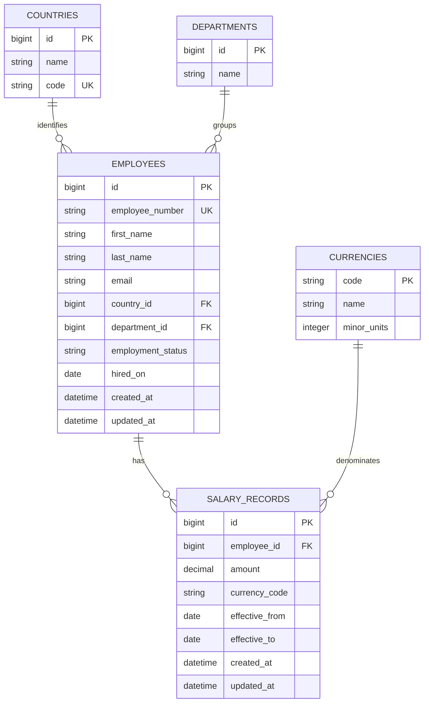

# Salary Management System — Database Design

**Status:** Proposed logical design; confirm details before migrations  
**Version:** 1.0

## 1. Design goals

- Store employee and salary information relationally.
- Preserve salary history.
- Support multiple countries and currencies.
- Support employee search, filtering, and compensation aggregates.
- Avoid storing derived payroll or tax results, which are out of scope.

## 2. Logical entity relationship

This is a proposed logical model, not a claim that the assessment supplied every field. Keep optional fields minimal and align the final schema with the approved requirements.

## 3. Tables

### employees

| Column | Type | Notes |
|---|---|---|
| `id` | bigint | Primary key |
| `employee_number` | string | Required, unique business identifier |
| `first_name`, `last_name` | string | Required display fields |
| `email` | string | Optional/required according to confirmed business rule; unique if required |
| `country_id` | bigint | Foreign key to countries |
| `department_id` | bigint | Foreign key to departments; nullable if unknown |
| `employment_status` | string | Constrained to documented values |
| `hired_on` | date | Optional unless required |

### salary_records

| Column | Type | Notes |
|---|---|---|
| `id` | bigint | Primary key |
| `employee_id` | bigint | Required foreign key |
| `amount` | decimal | Fixed-precision decimal; never binary floating point |
| `currency_code` | string(3) | ISO-style currency code; validate against supported reference data |
| `effective_from` | date | Required start date |
| `effective_to` | date | Nullable for a current/open-ended record |
| timestamps | datetime | Audit timestamps |

### countries

- `id`, `name`, and unique country code.
- Country list should be seeded from the agreed supported set; do not infer legal-entity rules.

### departments

- Minimal reference table with `id` and `name`.
- Add organization-specific hierarchy only if required.

### currencies

- Currency code, display name, and minor-unit precision.
- Seed only currencies needed by the dataset and business requirements.

## 4. Integrity and history rules

1. Employee number must be unique.
2. Salary amount must be positive unless a different valid business rule is agreed.
3. Currency code must be present and valid.
4. Effective start date must be present; end date, if supplied, cannot precede start date.
5. Define and enforce whether overlapping salary periods are prohibited for one employee.
6. A salary change must create a new historical record or otherwise preserve the prior value. Do not overwrite history silently.
7. Define whether the current salary is represented by `effective_to IS NULL` or by a date-based query. Use one consistent convention.
8. Use a database transaction when closing a prior salary period and creating a new one.

## 5. Index recommendations

Validate with actual query patterns and query plans. Likely candidates:

- Unique index on `employees.employee_number`.
- Indexes on `employees.country_id`, `employees.department_id`, and `employees.employment_status` when used for filtering.
- Composite index on `salary_records(employee_id, effective_from)`.
- Indexes for effective-date and currency filters if analytics queries demonstrate a need.

Avoid adding every possible index: indexes increase write and storage costs.

## 6. Currency and analytics

- Store monetary values as `DECIMAL`/`NUMERIC`.
- Group totals by currency code.
- Do not sum different currencies into one total.
- Cross-currency conversion is out of scope until a conversion source, date convention, and reporting policy are defined.
- Mean and median across employees should be clearly labeled and should not imply currency equivalence when currencies differ. Compute these per currency or within a defined comparable cohort.

## 7. Synthetic data

Generate approximately 10,000 deterministic synthetic employees across multiple countries and departments, with salary records in multiple currencies and a subset with historical changes. Do not use real employee data.

## 8. Open design decisions

- Required versus optional employee fields.
- Allowed employment statuses.
- Effective-date overlap policy.
- Whether salary history records need a separate change reason.
- Whether department and country changes need historical tracking.
- Currency conversion policy, if ever added.
