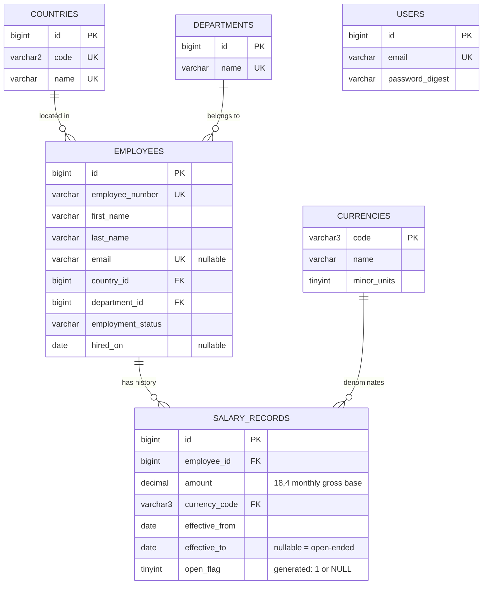

# Salary Management System — Database Design

**Status:** Approved design for migrations (BACKEND_PLAN.md task 1.3)  
**Version:** 2.0 (2026-09-28)  
**Engine:** MySQL 8.0.16+ (8.4 locally), InnoDB, `utf8mb4` / `utf8mb4_unicode_ci` (as generated in `backend/config/database.yml`)  
**Databases:** `salary_management` (development; the name comes from `DB_NAME`) and `salary_management_test`. In development, the Rails 8 Solid Cache and Solid Queue tables share the primary database. They are managed by their own schema files and are not part of this domain design.

Decision IDs (Dn) refer to `BACKEND_PLAN.md` Phase 1 findings and are summarised in `docs/requirements.md` §10.

## 1. Design goals

- A relational source of truth for employees and effective-dated salary history.
- Amount and currency are always stored together; there are no cross-currency aggregates (ADR 002).
- Salary history is preserved: changes add rows, and only the current record can be corrected (ADR 003, D4).
- Integrity is enforced in the database wherever MySQL can express it, and in a locked transaction where it cannot.
- Schema and indexes sized for about 10,000 employees and about 20,000 salary rows. No speculative denormalisation.
- No payroll, tax, or net-pay data.

## 2. Entity relationship



`USERS` has no relationships; it holds the single HR login (ADR 004). Every table also has `created_at` and `updated_at` (`DATETIME(6)`, NOT NULL), which serve as the audit timestamps (D5).

## 3. Tables

### 3.1 `users`

| Column | Type | Null | Constraints / notes |
|---|---|---|---|
| `id` | BIGINT | no | PK |
| `email` | VARCHAR(255) | no | UNIQUE; stored lower-case |
| `password_digest` | VARCHAR(255) | no | bcrypt hash via `has_secure_password` |

Provisioned only by `rails hr:create_user`, never by seeds.

### 3.2 `countries`

| Column | Type | Null | Constraints / notes |
|---|---|---|---|
| `id` | BIGINT | no | PK |
| `code` | VARCHAR(2) | no | UNIQUE; ISO 3166-1 alpha-2, upper-case (VARCHAR as generated by Rails, J3) |
| `name` | VARCHAR(100) | no | UNIQUE |

### 3.3 `departments`

| Column | Type | Null | Constraints / notes |
|---|---|---|---|
| `id` | BIGINT | no | PK |
| `name` | VARCHAR(100) | no | UNIQUE |

A flat list with no hierarchy.

### 3.4 `currencies`

| Column | Type | Null | Constraints / notes |
|---|---|---|---|
| `code` | VARCHAR(3) | no | **PK**; ISO 4217, upper-case (VARCHAR as generated by Rails, J3) (a natural key, so `salary_records.currency_code` is readable without a join) |
| `name` | VARCHAR(64) | no | |
| `minor_units` | TINYINT UNSIGNED | no | `CHECK (minor_units BETWEEN 0 AND 4)`; e.g. JPY 0, USD 2, KWD 3 |

Rails (implemented in 3.1): `create_table :currencies, id: false` with `t.string :code, limit: 3, null: false, primary_key: true`; `schema.rb` dumps it as `primary_key: "code", id: { type: :string, limit: 3 }`. The model sets `self.primary_key = "code"`.

### 3.5 `employees`

| Column | Type | Null | Constraints / notes |
|---|---|---|---|
| `id` | BIGINT | no | PK |
| `employee_number` | VARCHAR(20) | no | UNIQUE; upper-case letters, digits, and `-` (e.g. `EMP-00123`) |
| `first_name` | VARCHAR(100) | no | |
| `last_name` | VARCHAR(100) | no | |
| `email` | VARCHAR(255) | yes | UNIQUE (MySQL allows multiple NULLs); stored lower-case (D12) |
| `country_id` | BIGINT | no | FK → `countries.id`, ON DELETE RESTRICT |
| `department_id` | BIGINT | no | FK → `departments.id`, ON DELETE RESTRICT |
| `employment_status` | VARCHAR(20) | no | DEFAULT `'active'`; `CHECK (employment_status IN ('active','on_leave','terminated'))` (D12) |
| `hired_on` | DATE | yes | |

Employees are never deleted; termination is a status change (D13). Country and department are current values only, with no history.

### 3.6 `salary_records`

| Column | Type | Null | Constraints / notes |
|---|---|---|---|
| `id` | BIGINT | no | PK |
| `employee_id` | BIGINT | no | FK → `employees.id`, ON DELETE RESTRICT; read-only after create |
| `amount` | DECIMAL(18,4) | no | `CHECK (amount > 0)`; **monthly gross base** (D3); decimal places ≤ `currencies.minor_units` (model validation, D10) |
| `currency_code` | VARCHAR(3) | no | FK → `currencies.code`, ON DELETE RESTRICT; same type and collation as `currencies.code` (J3) |
| `effective_from` | DATE | no | Read-only after create |
| `effective_to` | DATE | yes | NULL = open-ended; `CHECK (effective_to IS NULL OR effective_to >= effective_from)`; set only by `Salaries::ChangeService` when closing a period |
| `open_flag` | TINYINT | yes | `GENERATED ALWAYS AS (IF(effective_to IS NULL, 1, NULL)) STORED`; supports the one-open-record index |

Rails (implemented in 3.2, `db/migrate/20260928100005_create_salary_records.rb`): `t.virtual :open_flag, type: :integer, limit: 1, as: "IF(effective_to IS NULL, 1, NULL)", stored: true`; `attr_readonly :employee_id, :effective_from`. The indexes are added before the foreign keys, so MySQL creates no extra FK indexes. **Schema round-trip verified (J13):** `schema.rb` keeps the virtual column and both CHECK constraints, and tests against the test database (built from `schema.rb`) prove the open-flag index and CHECKs fire.

## 4. Indexes

Each index is justified by a query or constraint. MySQL creates an index for every FK automatically, unless an existing index already starts with that column.

| Table | Index | Type | Serves |
|---|---|---|---|
| `users` | `(email)` | UNIQUE | Login lookup |
| `countries` | `(code)`, `(name)` | UNIQUE | Integrity, seed upsert |
| `departments` | `(name)` | UNIQUE | Integrity, seed upsert |
| `employees` | `(employee_number)` | UNIQUE | Identity; `q` match on number; sort |
| `employees` | `(email)` | UNIQUE | Integrity |
| `employees` | `(country_id)` | FK | Country filter, breakdown join |
| `employees` | `(department_id)` | FK | Department filter, breakdown join |
| `employees` | `(employment_status)` | secondary | Status filter; analytics exclude terminated |
| `employees` | `(last_name, first_name)` | secondary | Sort by name |
| `salary_records` | `(employee_id, effective_from)` | UNIQUE | One record per start date; history listing in order; latest-record lookup under lock; FK index for `employee_id` |
| `salary_records` | `(employee_id, open_flag)` | UNIQUE | **At most one open-ended record per employee** (NULLs do not collide) |
| `salary_records` | `(currency_code)` | FK | Currency FK, currency filter |

Not added up front: composite filter indexes on `employees`, sort indexes for `hired_on` and `created_at` (a filesort over about 10k rows is cheap), and an `(effective_from, effective_to)` index. At this scale, as-of scans over about 20k salary rows are cheap. Phase 6.2 will measure with `EXPLAIN ANALYZE` on seeded data and add indexes only where the plans show a need.

## 5. Integrity rules and where they are enforced

| # | Rule | Database | Model validation | Service (locked transaction) |
|---|---|---|---|---|
| I1 | Employee number present and unique | NOT NULL, UNIQUE | presence, format, uniqueness | — |
| I2 | Employee references a valid country and department | FK, NOT NULL | presence | — |
| I3 | Status is one of the allowed values | CHECK | inclusion | — |
| I4 | Amount > 0 | CHECK | numericality | — |
| I5 | Amount scale ≤ currency minor units | — | custom validation | — |
| I6 | Currency exists | FK | presence | — |
| I7 | `effective_to` ≥ `effective_from` | CHECK | comparison | — |
| I8 | One record per employee per start date | UNIQUE | uniqueness | — |
| I9 | At most one open-ended record per employee | UNIQUE on `open_flag` | — | — |
| I10 | No overlapping periods; a new record starts after the latest one | — (MySQL has no exclusion constraints) | overlap check (defence in depth) | `ChangeService`: lock employee row → verify → close prior → insert |
| I11 | Historical records are immutable. Only the amount and currency of the record in effect today, or of a future-dated record, can change (D4 + O1) | `attr_readonly` columns | — | `CorrectionService`: lock → verify editable → update |
| I12 | No hard deletes of employees or salary records | ON DELETE RESTRICT | no destroy routes | — |
| I13 | `effective_from` ≥ `hired_on` when `hired_on` is present. This is enforced both ways: a salary can't start before hire, and an employee update can't move `hired_on` after that employee's earliest salary `effective_from` | — | custom validation on SalaryRecord and Employee | — |

I10 relies on every write going through the services. Direct SQL or console writes could bypass it; the model-level overlap validation catches most of these cases.

## 6. Transactions and concurrency

- **Salary change** (`Salaries::ChangeService`):
  1. `BEGIN`
  2. `SELECT … FROM employees WHERE id = ? FOR UPDATE`
  3. Read the latest record (by `effective_from DESC`).
  4. Reject if `new.effective_from <= latest.effective_from` (D8).
  5. `UPDATE latest SET effective_to = new.effective_from - 1 day`
  6. `INSERT` the new record.
  7. `COMMIT`

  If there is no prior record, only the insert runs.
- **Correction** (`Salaries::CorrectionService`): the same employee-row lock. Verify the record is **editable**, then update `amount` and/or `currency_code`. A record is editable when it is in effect on `Date.current`, or when its `effective_from` is after `Date.current` (future-dated, O1). Records whose period ended before today are historical and rejected.
- **Employee create with an initial salary** (`Employees::CreateService`): both inserts run in one transaction.
- **Isolation:** InnoDB's default `REPEATABLE READ`. The employee-row lock serialises all salary writes for one employee, and the unique indexes (I8, I9) are the backstop if the lock is bypassed.
- Any failure rolls back the whole operation. Constraint violations (`ActiveRecord::RecordNotUnique`, `ActiveRecord::StatementInvalid` from a CHECK) are mapped to `422` with a generic message.

## 7. Query shapes

Every salary read that needs "current salary" uses one shared scope (D7). `:as_of` defaults to `Date.current` (UTC, D9):

```sql
-- SalaryRecord.in_effect_on(as_of)
sr.effective_from <= :as_of AND (sr.effective_to IS NULL OR sr.effective_to >= :as_of)
```

Because periods never overlap (I10), this yields at most one row per employee. Analytics population (D20): join to `employees` with `employment_status IN ('active','on_leave')` by default, plus the optional `country_id`, `department_id`, and `employment_status` filters.

### 7.1 Summary per currency

```sql
SELECT sr.currency_code,
       COUNT(*)       AS employee_count,
       SUM(sr.amount) AS total_monthly,
       AVG(sr.amount) AS average_monthly,
       MIN(sr.amount) AS min_monthly,
       MAX(sr.amount) AS max_monthly
FROM salary_records sr
JOIN employees e ON e.id = sr.employee_id
WHERE <in_effect_on> AND <employee filters>
GROUP BY sr.currency_code;
```

The response's `employees_in_scope` is a `COUNT(*)` of `employees` with the same filters. `employees_without_salary` is that count minus the employees with a salary in effect on the date. Both are `employees`-only counts with no monetary values.

### 7.2 Median per currency (D21)

MySQL has no `MEDIAN()` or `PERCENTILE_CONT`, so the median uses window functions:

```sql
WITH cur AS (
  SELECT sr.currency_code, sr.amount
  FROM salary_records sr JOIN employees e ON e.id = sr.employee_id
  WHERE <in_effect_on> AND <employee filters>
), ranked AS (
  SELECT currency_code, amount,
         ROW_NUMBER() OVER (PARTITION BY currency_code ORDER BY amount) AS rn,
         COUNT(*)     OVER (PARTITION BY currency_code)                 AS cnt
  FROM cur
)
SELECT currency_code, AVG(amount) AS median_monthly
FROM ranked
WHERE rn IN (FLOOR((cnt + 1) / 2), CEIL((cnt + 1) / 2))
GROUP BY currency_code;
```

With an odd count this picks the middle row; with an even count it averages the two middle rows. The breakdown uses the same pattern, partitioned by `(dimension, currency_code)`.

### 7.3 Distribution bands per currency (D22)

There are 10 fixed-width bands between each currency's MIN and MAX. A row's band index is the number of k = 1…9 with `(amount - min) * 10 >= k * (max - min)` (implemented in 5.1). This uses only exact decimal multiplication; dividing by a pre-computed width would let MySQL's rounded decimal division move a value that sits on an edge. The minimum falls in band 0 and the maximum in band 9. If `max = min`, all rows go in a single band. All 10 bands are returned, including empty ones. Edges are exact (`min + k * (max - min) / 10`, computed in Ruby with BigDecimal) and rounded to minor units only for display. The response returns `lower`, `upper`, and `count` for each band. Bands are lower-inclusive and upper-exclusive, except the last band, which includes its upper edge.

### 7.4 Breakdown (by country or department)

Group by `(e.country_id | e.department_id, sr.currency_code)` and compute the count, total, average, and median (§7.2 pattern). The dimension name comes from joining `countries` or `departments`. The rows are keyed by dimension *and* currency, so an employee paid in USD in Germany appears in the Germany/USD row, not in Germany/EUR.

### 7.5 Salary report (JSON and CSV, D19/D24)

Employees joined to their in-effect salary as of `:as_of` (INNER JOIN, so employees with no salary on that date are excluded), plus the country and department names. It uses the same employee filters as analytics plus `q`. Sorting is by `employee_number` by default, or by `last_name` or `(currency_code, amount)` from the API allowlist, always with `id` as the tie-breaker. The JSON form is paginated. The CSV runs the same ordered query once with `LIMIT 10,001` (only the allowlisted columns are plucked); more than 10,000 rows returns `422 export_too_large`. Batch iteration is not used because it forces primary-key order.

### 7.6 Employee search

`q` is matched with `LIKE` against `employee_number`, `first_name`, and `last_name`. The input is escaped with `sanitize_sql_like`, and the `utf8mb4_unicode_ci` collation makes the match case-insensitive and, for most Latin characters, accent-insensitive. The match is a contains match (`%q%`), which scans the table; that is acceptable at about 10k rows (D27) and will be re-checked in Phase 6.2.

### 7.7 Rounding

SQL returns exact `DECIMAL` values. The jbuilder views (via a shared `_money` partial or helper) round each monetary aggregate to the currency's `minor_units` with half-up rounding and return it as a string. Rounding is display-only; stored amounts are never rounded.

## 8. Reference data

The seeded set supports the demo and tests. Adding to it later is a seed change, not a schema change.

| Country | Code | Currency (minor units) |
|---|---|---|
| United States | US | USD (2) |
| United Kingdom | GB | GBP (2) |
| Germany | DE | EUR (2) |
| France | FR | EUR (2) |
| India | IN | INR (2) |
| Japan | JP | JPY (0) |
| Singapore | SG | SGD (2) |
| Kuwait | KW | KWD (3) |

JPY and KWD are included on purpose, to exercise 0- and 3-decimal precision (D10).

Departments: Engineering, Finance, Human Resources, Marketing, Operations, Sales, Legal, Customer Support.

## 9. Seed strategy (implemented in 3.3)

Seeds are split into reference data and demo data (J6).

**Reference data**
- Defined once in `backend/lib/reference_data.rb` (the §8 values, plus each country's home currency).
- `bin/rails db:seed` calls `ReferenceData.seed!`, which runs `upsert_all` on MySQL (`ON DUPLICATE KEY UPDATE`).
- Idempotent: a second run changes no rows (verified by identical `CHECKSUM TABLE` values). Safe in every environment, including production. Needs no Faker.
- The test fixtures hold the same values, and a test asserts they match.

**Demo data (development only)**
- `bin/rails demo:seed` runs `Demo::Seeder` (`backend/lib/demo/seeder.rb`).
- Deterministic: random seed 42 for Ruby's `Random` and Faker, plus a **fixed as-of date of 2026-09-28**, so every run produces identical rows (verified by a data fingerprint before and after `demo:reset`).
- Volume and distribution of a run (actual counts):
  - 10,000 employees and 16,826 salary records, loaded in about 1.5 s.
  - Employees per country: 1,211–1,294 in each of the 8 countries.
  - Statuses: 9,046 active, 383 on leave, 571 terminated.
  - Current salaries per currency: EUR 2,343; USD 1,689 (US plus about 5% of other employees paid in USD, D11); GBP 1,140; INR 1,156; JPY 1,201; KWD 1,213; SGD 1,163.
  - Records per employee: 1 → 6,207; 2 → 1,517; 3 → 1,168; 4 → 984; 5 → 29.
  - 95 employees with no salary (D14); 200 scheduled (future-dated) records (D6).
  - Monthly amounts are drawn from per-currency ranges and rounded to the currency's minor units. Raises are 2–12% every 6–24 months, starting on or after the hire date.
- Loading: history rows are generated already closed (`effective_to` = next start − 1). Employees and salaries are inserted with **`insert_all!`** in batches of 1,000 in one transaction; plain `insert_all` silently skips unique-key conflicts on MySQL (found in 3.1).
- Re-runs: `demo:seed` refuses if employees exist. `bin/rails demo:reset` deletes all salary records and employees, then seeds again. Both refuse unless `Rails.env.development?`. Reference data and `users` are never deleted.
- `bin/rails demo:verify` runs the §12 checks read-only in any environment.

**Tests** build their own data with FactoryBot and fixtures, never the seed files. The seeder is tested with 300 employees.

## 10. Trade-offs

| Choice | Alternative | Reason |
|---|---|---|
| Currency code as the natural PK | Surrogate `id` | Readable FK, and the value is immutable |
| Generated `open_flag` + UNIQUE | Partial unique index (PostgreSQL only) | MySQL has no partial indexes; a generated column gives the same guarantee |
| Overlap checked in a locked service | Triggers | Triggers hide logic and are hard to test; one service owns the rule |
| `DECIMAL(18,4)` | `DECIMAL(15,2)` | Supports 3-decimal currencies; 14 integer digits is ample for monthly pay |
| Median via window functions | Median computed in Ruby | Stays in SQL and scales with filters; covered by known-data tests |
| No country or department history | Effective-dated org tables | Not required (docs/requirements.md §7) |

## 11. Rules added during design (approved 2026-09-28)

- **I13 (approved):** `effective_from` must not precede `hired_on` when `hired_on` is present.
- **O1 (approved):** besides the record in effect today, a **future-dated** record (with `effective_from` after today) can have its `amount` and `currency_code` corrected, because it has not taken effect yet and is not history. Dates remain read-only. A future record with a wrong start date cannot be fixed in v1; this limitation is documented.
- **Termination:** setting an employee to `terminated` does not close their open salary record. They drop out of analytics through the status filter instead.

## 12. Integrity verification (3.3)

Each rule, where it is enforced, and the test that proves it. The SQL checks in `backend/lib/demo/integrity_check.rb` (`bin/rails demo:verify`) re-check I4, I5, I7, I9, I10, and I13 against any data. They returned 0 violations on the 10,000-employee demo data.

| Rule | Enforced by | Proven by (backend/test/…) |
|---|---|---|
| I1 unique employee number | UNIQUE index; model format and uniqueness | `models/employee_test.rb`: unique number, DB rejects duplicate |
| I2 valid country and department | FK, NOT NULL; `belongs_to` | `models/employee_test.rb`: required references, DB rejects unknown country |
| I3 allowed status | CHECK; enum `validate: true` | `models/employee_test.rb`: documented statuses, DB check constraint |
| I4 amount > 0 | CHECK; numericality | `models/salary_record_test.rb`: positive amount, DB checks; integrity SQL |
| I5 scale ≤ minor units | Model (raw input); integrity SQL | `models/salary_record_test.rb`: JPY, USD, KWD, beyond column scale; `services/salaries/correction_service_test.rb`: currency switch; `lib/demo/integrity_check_test.rb` |
| I6 currency exists | FK to `currencies.code`; `belongs_to` | `models/salary_record_test.rb`: existing currency, DB FK |
| I7 period order | CHECK; comparison | `models/salary_record_test.rb`: `effective_to` ≥ `effective_from`, DB checks |
| I8 one record per start date | UNIQUE `(employee_id, effective_from)` | `models/salary_record_test.rb`: same start date; `services/salaries/change_service_test.rb`: same-date rejected |
| I9 one open record | Generated `open_flag` + UNIQUE | `models/salary_record_test.rb`: open flag, only one open record; integrity SQL |
| I10 no overlapping periods | `ChangeService` under row lock; model validation; integrity SQL | `models/salary_record_test.rb`: overlap; `services/salaries/change_service_test.rb`; `lib/demo/integrity_check_test.rb` |
| I11 history immutable, dates read-only | `attr_readonly`; `CorrectionService` | `models/salary_record_test.rb`: read-only columns; `services/salaries/correction_service_test.rb` |
| I12 no hard deletes | FK (RESTRICT); `restrict_with_exception`; no destroy routes | `models/country_test.rb`, `department_test.rb`, `salary_record_test.rb`; `integration/api/v1/employees_test.rb` and `salary_records_test.rb` (`DELETE` → 404, record kept) |
| I13 salary not before hire | Model (both sides); integrity SQL | `models/salary_record_test.rb`, `models/employee_test.rb`, `services/salaries/change_service_test.rb`, `services/employees/create_service_test.rb`, `lib/demo/integrity_check_test.rb` |

No open gaps: I12's "no destroy routes" was verified in 4.3 (employees) and 4.4 (salary records).
